> ⚙️ Are you a developer? See [README_DEV.md](./README_DEV.md) for setup and technical details.

# Employee Handbook App

## Overview

The **Employee Handbook App** is a web-based platform that helps workers understand their rights and company policies using an AI-powered chatbot. It features both public and private access levels, providing support for general legal information and organization-specific policies.

Our partner is **Arshad Merali** from Rivvi, a Toronto-based fintech company focused on improving financial health and workplace transparency.

## Access the App

The app can be accessed at https://employee-handbook-app.vercel.app/.

## Target Users

- **Public Users:** Employees across Canada seeking clarification on general work rights
- **Private Users:** Employees granted access to their employer’s internal policies via secure login

## User Roles & Permissions
- **Employee**
  can interact with the chatbot to access company-specific policies.

- **Financer**
  can interact with the chatbot and view the **Finances** and **Analytics** pages.

- **Administrator**
  can:

  * Interact with the chatbot
  * Upload company policy documents
  * View Finances and Analytics pages
  * Manage company members (e.g., change roles)

- **Owner**
  can:

  * Create a company
  * Subscribe to a paid plan
  * Access all features available to administrators and financers

## Instructions/Features

Access the link above.

On landing, select your province/territory.
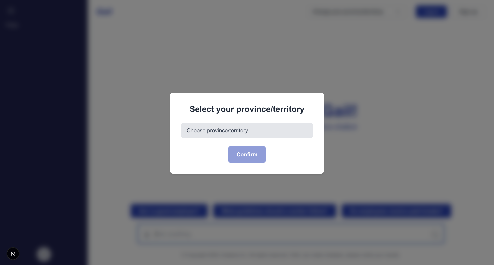

Then, you may select any of the suggested questions, or type in your own question related to workplace rights/regulations.
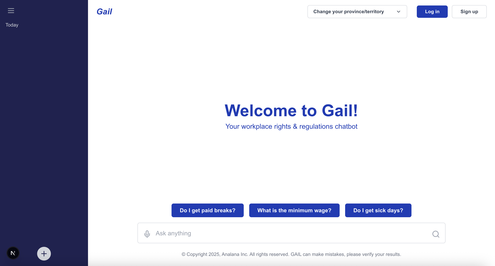

The chatbot will give you an answer given your selected province/territory and you can take a closer look at any of the sources by clicking on them.
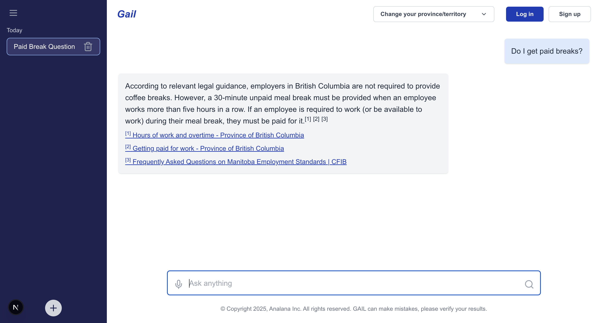

The province dropdown allows you to change your province. The chatbot will tailor its answers to this province.
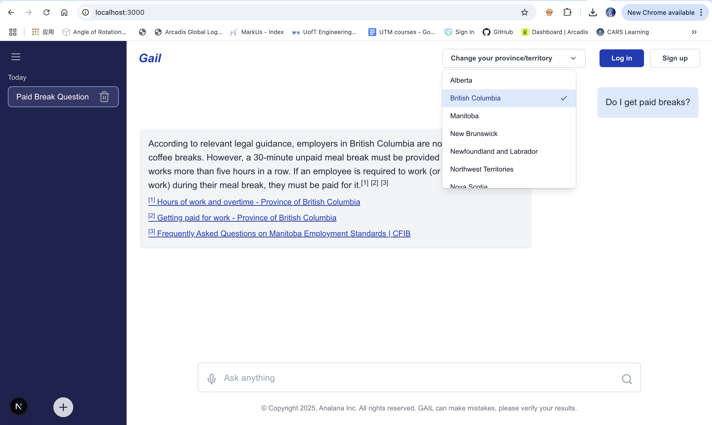

You can also choose to log in or sign up using the buttons at the top right. Upon pressing the **Log in** button, you will be redirected to the Clerk login page.

After logging in, you will be able to create new chats, see your chat history and your messages will be stored.
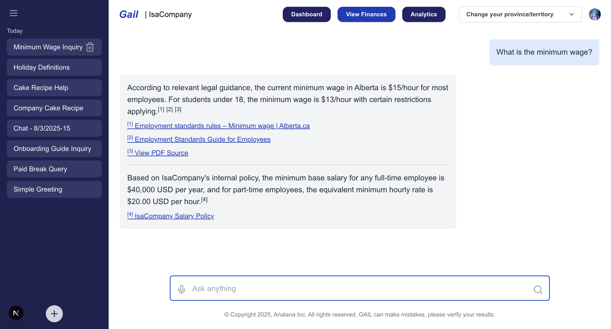

If you don't have an account, you can sign up using the **Sign Up** button. You will be asked whether you want to continue as an employee or an employer.

If you choose to sign up as an employee, you will be taken to the sign up page by Clerk, where you can enter your email and password to create an account or use Google sign in.

If you choose to sign up as an employer, you will see the same page but upon completion, you will be taken to the dashboard which allows you to upload documents, view analytics and more. 
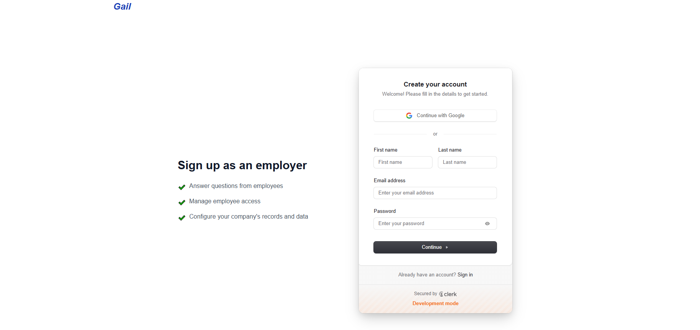

As an employer, you can upload your company policies and documents, add employees, view finances, view analytics and access the chatbot.
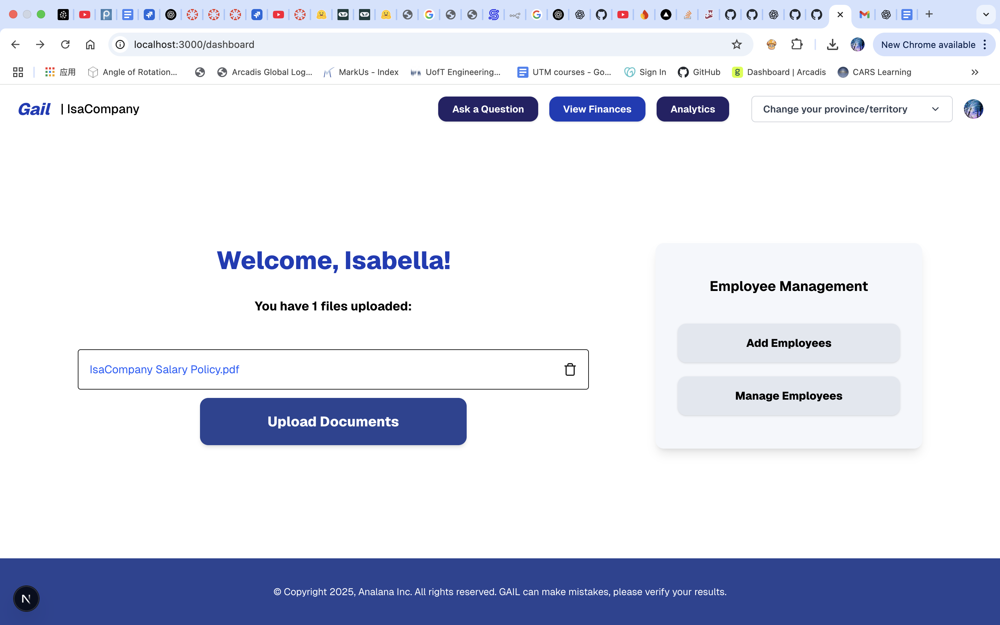

Owners can then add employees to their company by sending invites through email. They can view pending, expired and accepted invitations. Additionally, they have the option to delete a pending invitation, effectively making it expired.
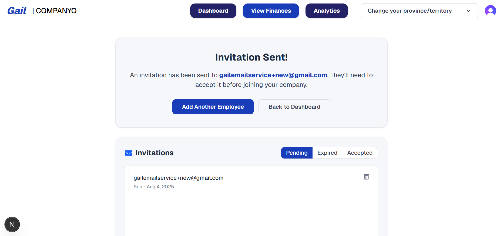

Invited employees will recieve an email in which clicking the provided link allows them to join the company.
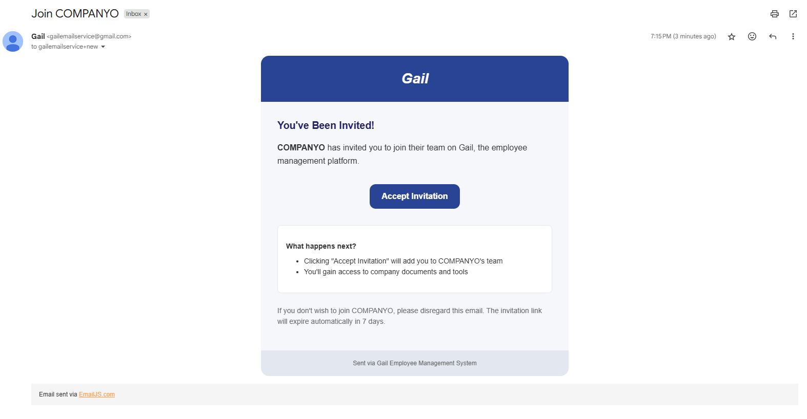
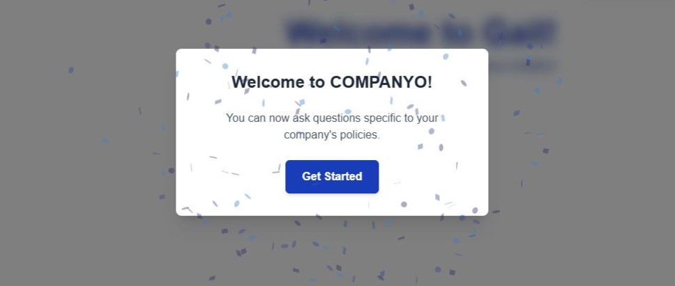

The analytics page will show you the number of employees, total questions asked and more.
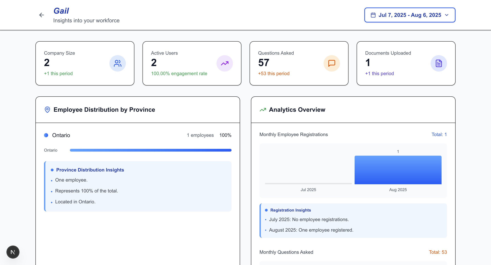

The finance page will show the current subscription status, billing details, and pricing tiers.
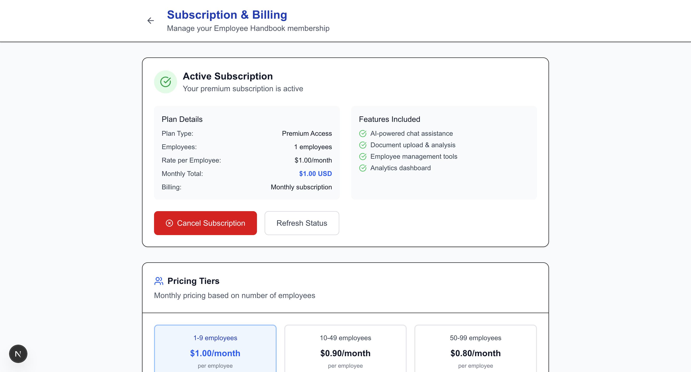

## Things to Know
### Chat History
- All users (public or logged-in) can view their recent chat history.
- A maximum of 8 recent chats are stored per user.

### Add Employee Feature

To allow owners to give their employees access to their policy documents, owners are able to add employees to their company through the dashboard. Here, owners can send an invite using the invitee's email, and the email will be sent through EmailJS. There are a few checks that take place just to ensure the employee is not already in a company, that they have not already recieved an email by the sender, and that they exist in our database. These invites expire within 7 days if not accepted by the employee, or if they are cancelled by the sender. Upon such circumstances, the invite will redirect to an invalid or expired invitation page. Once accepted, the employee will view a welcome message, see their company's name on the chat page and will have access to company-specific policies.

### Stripe Payment Integration

To support subscription-based access and control for employer-only features (e.g., uploading company documents, team management, analytics), we integrated Stripe Checkout with a **free 7-day trial** for new employer accounts.

#### Free Trial

New employers receive a **1-week free trial** after sign-up to explore the platform, upload documents, and invite employees. Once the trial ends, if no subscription is active, the employer is redirected to the paywall and temporarily loses access to premium features until payment is completed.

#### How It Works

When an employer visits the Home Page, the app checks their **trial and subscription status** by querying Firebase.

- If the employer has an active subscription or is within the free trial period, they are redirected to the **Dashboard**.
- If neither is active, they are redirected to the **Paywall Page**.

On the Paywall Page:

- Clicking Subscribe starts the payment process.
- After payment is completed, the system updates the employer’s account to reflect the new subscription.
- Once that’s done, they’ll have full access to all premium features on their Dashboard.

The demo is as follows:

<video width="320" height="240" controls>
  <source src="deliverables/D2/images/demo.mp4" type="video/mp4">
  Your browser does not support the video tag.
</video>

## Target Users

- **Public Users:** Employees across Canada seeking clarification on general work rights
- **Private Users:** Employees granted access to their employer’s internal policies via secure login

## MVP - Minimum Viable Product

1. **Public Q&A:** Users can ask legal work-related questions through the chatbot.
2. **Private Login & Q&A:** Logged-in users access company-specific policy documents and ask personalized questions.
3. **Link to Sources:** All answers include source references for verification.
4. **Secure Authentication:** Private users authenticate through Clerk to access company info.
5. **Multi-device Compatibility:** Platform works on phones, tablets, and desktops.

## User Stories

1. **General legal info access**: Unauthenticated users can ask the chatbot about general labor laws to understand workplace rights.
2. **Company-specific guidance**: Registered employees can access personalized answers based on their company’s policies.
3. **Quick refresh on internal rules**: Employees can use the chatbot to recall company policies easily without asking redundant questions.
4. **Employer policy upload**: Employers can register and upload company policies to create a private knowledge base for employees.
5. **Verified and current info**: The chatbot provides source links with every answer to ensure responses are accurate and trustworthy.
6. **Join company space**: Employees can enter a unique company code to access their employer’s documents and ask company-specific questions.
7. **Chat history**: Logged-in employees can view a personal history of past questions and chatbot responses for easy reference.

## Future Use Tips
- Use the dashboard to upload your company policies.
- Encourage employees to log in for personalized answers.
- Review analytics to understand employee usage trends.

## Task Management

- GitHub Issues and a shared structured doc for dev tracking
- Partner meetings twice a week (Fridays & Mondays)
- Team meetings on Tuesdays (12–1pm) & Sundays (12–1pm)

## Partner

**Arshad Merali**  
Email: arshad@rivvi.com

## Git & GitHub Workflow

We follow a collaborative, branch-based development process on GitHub:

- **Branch Naming:** Each feature or bug fix is implemented on a dedicated branch (e.g., `feature/Chat`, `fix/signup`).
- **Pull Requests:** All changes are submitted via pull requests, using the `pull_request_template.md` to ensure clarity and accountability.
- **Code Review:** Every PR is reviewed during our regular team meetings on Zoom/Discord, where all members are present and provide collective feedback before merging into `develop` and then `main`.
- **Main Branch Stability:** The `main` branch always contains the latest stable, deployable version of the app.
- **Continuous Integration:** Our app is deployed via Vercel whenever changes are pushed to the `main` branch, ensuring quick feedback and stable releases.

This workflow ensures that our team collaborates smoothly, avoids merge conflicts, and maintains clean, working code throughout development.
