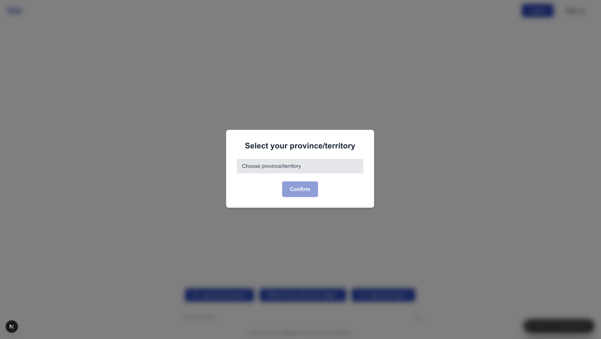
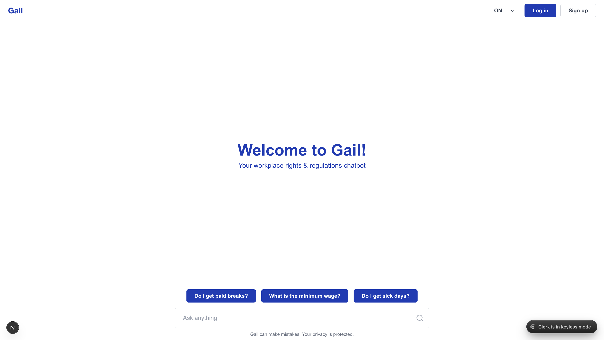
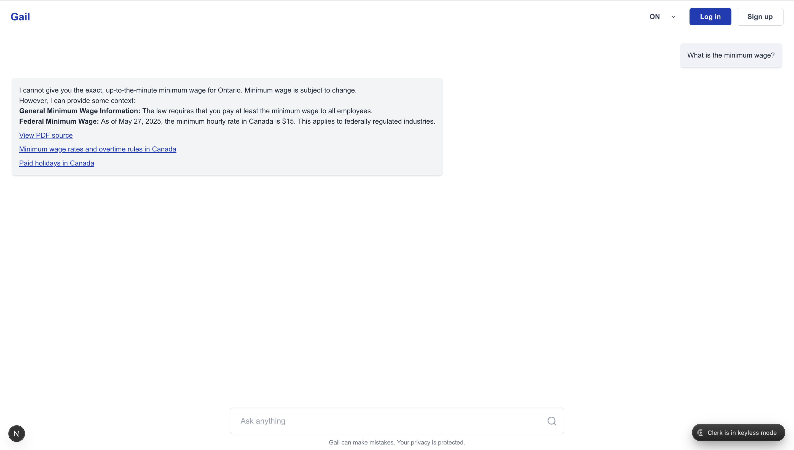
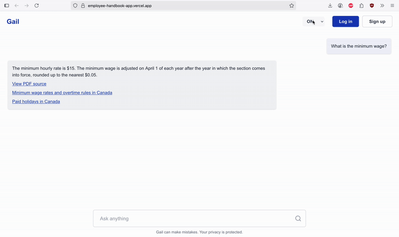
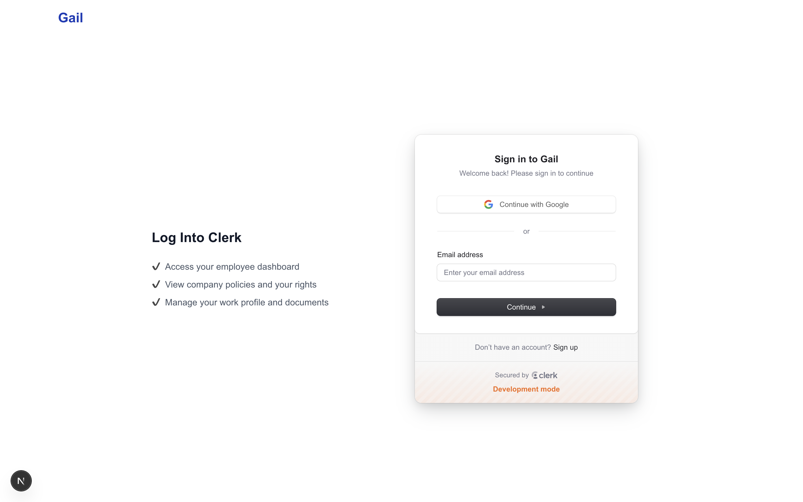
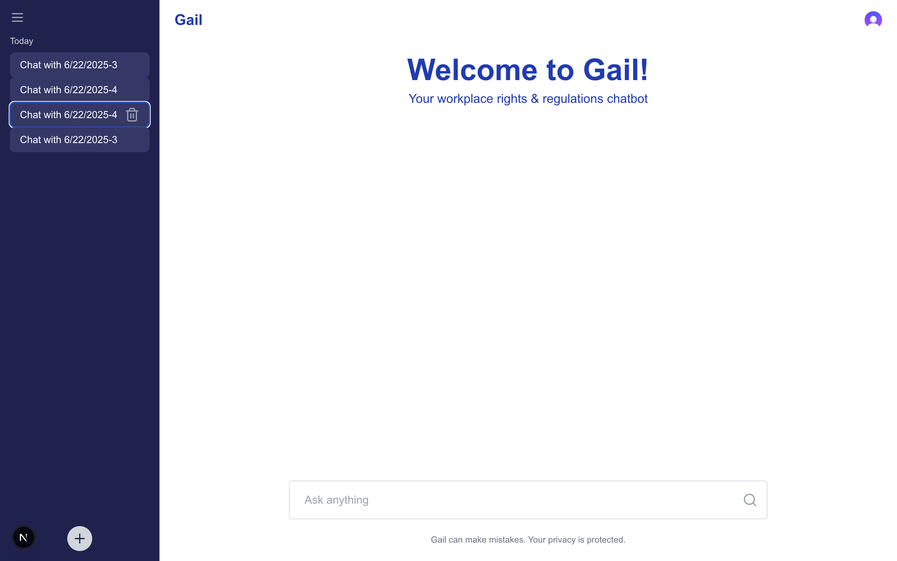
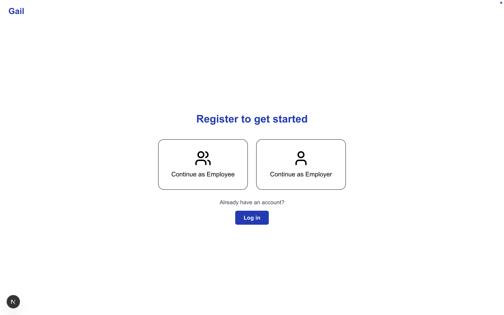
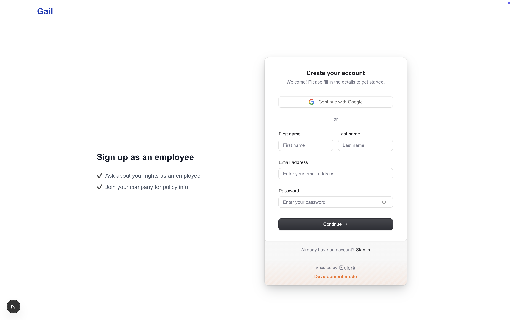
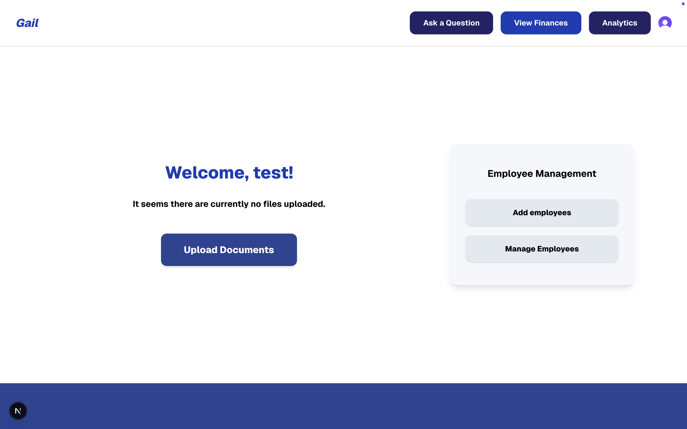
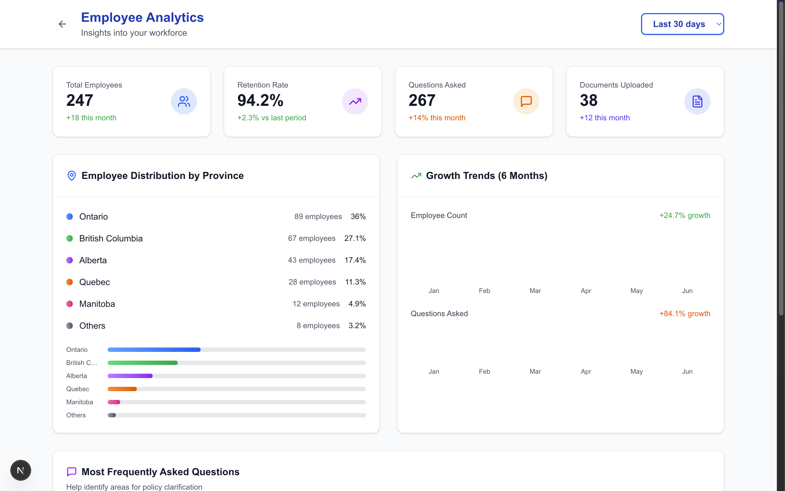

# Employee Handbook App

## Overview

The **Employee Handbook App** is a web-based platform that helps workers understand their rights and company policies using an AI-powered chatbot. It features both public and private access levels, providing support for general legal information and organization-specific policies.

Our partner is **Arshad Merali** from Rivvi, a Toronto-based fintech company focused on improving financial health and workplace transparency.

## Link of the app
The app can be accessed at https://employee-handbook-app.vercel.app/.

(Note: Backend is hosted on Render (free tier), so there may be ~30s cold start delay on first load.)

## Instructions/Features
Access the link above.

On landing, select your province/territory.


Then, you may select any of the suggested questions, or type in your own question related to workplace rights/regulations.


The chatbot will give you an answer given your selected province/territory and you can take a closer look at any of the sources by clicking on them.


The province dropdown allows you to change your province. The chatbot will tailor its answers to this province.


You can also choose to log in or sign up using the buttons at the top right. Upon pressing the "Log in" button, you will be redirected to the Clerk login page. 



After logging in, you will be able to create new chats, see your chat history and your messages will be stored.


If you don't have an account, you can sign up using the **Sign Up** button. You will be asked whether you want to continue as an employee or an employer. As of now, Signup only works when using email. Signup with google needs a bit more work to be done.


If you choose to sign up as an employee, you will be taken to the sign up page by Clerk, where you can enter your email and password to create an account.As of now, Signup only works when using email. Signup with google needs a bit more work to be done.


If you choose to sign up as an employer, you will see the same page but upon completion, you will be taken to the dashboard which allows you to upload documents, view analytics and more. In the future, you will be able to upload your company policies and documents.


As an employer, you can upload your company policies and documents, add employees, view finances, view analytics and access the chatbot. Some functionality will be implemented in the future, but you can already upload documents.


The analytics page will show you the number of employees, total questions asked and more.


Right now there's no restrictions on who can access the employer dashboard. This will be implemented in the future.


## Setup (For Developers)

This project consists of two parts:

* **Next.js App** — handles most endpoints and the user interface
* **AI Service** — powers the AI chatbot through a separate Python backend

### 1. Next.js App

To start the main app:

```bash
cd employee-handbook-app
npm install
npm run dev
```

### 2. AI Service (for chatbot only)

To start the AI backend:

```bash
cd AIService
pip install -r requirements.txt
uvicorn main:app --reload
```

To load documents into Pinecone, run the following in a new terminal:

```bash
cd AIService
python scrapeAllData.py   # Scrapes links from providedDocSample.json and saves data to a pickle file
python setup.py           # Uploads data from the pickle file to Pinecone
```
**Note:** These commands should only be run if `providedDocSample.json` has been updated, as they can take a long time to complete.

**Requirements:**

* Node.js and npm
* Python 3.x and pip

**Environment variables:**

Create a `.env.local` file and put the following keys:

```
AI_SERVICE_URL=<your_AI_service_public_url>
NEXT_PUBLIC_SENTRY_DSN=<your_sentry_dsn>
NEXT_PUBLIC_FIRESTORE_API_KEY=<your_firestore_api_key>
NEXT_PUBLIC_FIRESTORE_AUTH_DOMAIN=<your_firestore_auth_domain>
NEXT_PUBLIC_FIRESTORE_PROJECT_ID=<your_firestore_project_id>
NEXT_PUBLIC_FIRESTORE_STORAGE_BUCKET=<your_firestore_storage_bucket>
NEXT_PUBLIC_FIRESTORE_MESSAGING_SENDER_ID=<your_firestore_messaging_sender_id>
NEXT_PUBLIC_FIRESTORE_APP_ID=<your_firestore_app_id>
NEXT_PUBLIC_FIRESTORE_MEASUREMENT_ID=<your_firestore_measurement_id>
GOOGLE_API_KEY=<your_google_api_key>
PINECONE_API_KEY=<your_pinecone_api_key>
PINECONE_INDEX_NAME=<your_pinecone_index_name>
NEXT_PUBLIC_CLERK_PUBLISHABLE_KEY=<your_clerk_publishable_key>
CLERK_SECRET_KEY=<your_clerk_secret_key>
CLERK_WEBHOOK_SECRET=<your_clerk_webhook_secret>
CLERK_MODE=<your_clerk_mode> # e.g., development or production

FIREBASE_TYPE=service_account
FIREBASE_PROJECT_ID=<your_firebase_project_id>
FIREBASE_PRIVATE_KEY_ID=<your_firebase_private_key_id>
FIREBASE_PRIVATE_KEY=<your_firebase_private_key>
FIREBASE_CLIENT_EMAIL=<your_firebase_client_email>
FIREBASE_CLIENT_ID=<your_firebase_client_id>
FIREBASE_AUTH_URI=<your_firebase_auth_uri>
FIREBASE_TOKEN_URI=<your_firebase_token_uri>
FIREBASE_AUTH_PROVIDER_CERT_URL=<your_firebase_auth_provider_cert_url>
FIREBASE_CLIENT_CERT_URL=<your_firebase_client_cert_url>
FIREBASE_UNIVERSE_DOMAIN=<your_firebase_universe_domain>

```

## Documentation
The documentation for the AI service endpoints is located in the `AIService/` folder. You can either import `AIService_postman_collection.json` into Postman, or open `AIService_collection.openapi` using [Swagger Editor](https://editor.swagger.io/).

## Core Features

- AI Chatbot that answers employee questions
- Public access to general employment laws
- Private, secure login for company-specific policy access
- Document linking and source transparency
- Accessible on web, mobile, and tablet devices

## Target Users

- **Public Users:** Employees across Canada seeking clarification on general work rights
- **Private Users:** Employees granted access to their employer’s internal policies via secure login

## MVP - Minimum Viable Product

1. **Public Q&A:** Users can ask legal work-related questions through the chatbot.
2. **Private Login & Q&A:** Logged-in users access company-specific policy documents and ask personalized questions.
3. **Link to Sources:** All answers include source references for verification.
4. **Secure Authentication:** Private users authenticate through Clerk to access company info.
5. **Multi-device Compatibility:** Platform works on phones, tablets, and desktops.

## User Stories

1. **General legal info access**: Unauthenticated users can ask the chatbot about general labor laws to understand workplace rights.
2. **Company-specific guidance**: Registered employees can access personalized answers based on their company’s policies.
3. **Quick refresh on internal rules**: Employees can use the chatbot to recall company policies easily without asking redundant questions.
4. **Employer policy upload**: Employers can register and upload company policies to create a private knowledge base for employees.
5. **Verified and current info**: The chatbot provides source links with every answer to ensure responses are accurate and trustworthy.
6. **Join company space**: Employees can enter a unique company code to access their employer’s documents and ask company-specific questions.
7. **Chat history**: Logged-in employees can view a personal history of past questions and chatbot responses for easy reference.

## Tech Stack

### Frontend

- **Framework:** Next.js
- **UI Libraries:** React, shadcn/ui
- **Styling:** Tailwind CSS
- **Icons:** Lucide Icons

### Backend & AI

- **Languages:** TypeScript (main app), Python (AI module)
- **NLP Tools:** LangChain, LLM APIs
- **API Routing:** Vercel API Routes

### Storage & Infrastructure

- **Database:** Firebase
- **Vector DB:** Pinecone
- **Authentication:** Clerk
- **Hosting:** Vercel, Render
- **Monitoring:** Sentry
- **Analytics:** Google Analytics
- **Payment Gateway:** Stripe (if needed)

## Tech Architecture 


## Task Management

- GitHub Issues and a shared structured doc for dev tracking
- Partner meetings twice a week (Fridays & Mondays)
- Team meetings on Tuesdays (7–8pm) & Sundays (12–1pm)

## Intellectual Property

Students will only reference the work they did in their resume, interviews, etc. They agree to not share the code or software in any capacity with anyone unless their partner has agreed to it.

## Partner

**Arshad Merali**  
Email: arshad@rivvi.com

## Git & GitHub Workflow

We follow a collaborative, branch-based development process on GitHub:

- **Branch Naming:** Each feature or bug fix is implemented on a dedicated branch (e.g., `feature/Chat`, `fix/signup`).
- **Pull Requests:** All changes are submitted via pull requests, using the `pull_request_template.md` to ensure clarity and accountability.
- **Code Review:**  Every PR is reviewed during our regular team meetings on Zoom/Discord, where all members are present and provide collective feedback before merging into `main`.
- **Main Branch Stability:** The `main` branch always contains the latest stable, deployable version of the app.
- **Continuous Integration:** Our app is deployed via Vercel whenever changes are pushed to the `main` branch, ensuring quick feedback and stable releases.


This workflow ensures that our team collaborates smoothly, avoids merge conflicts, and maintains clean, working code throughout development.

## License

Proprietary – not open source. Code cannot be published or shared externally.
