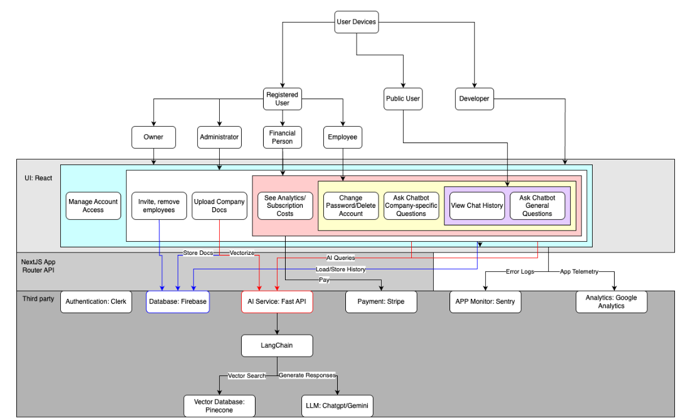
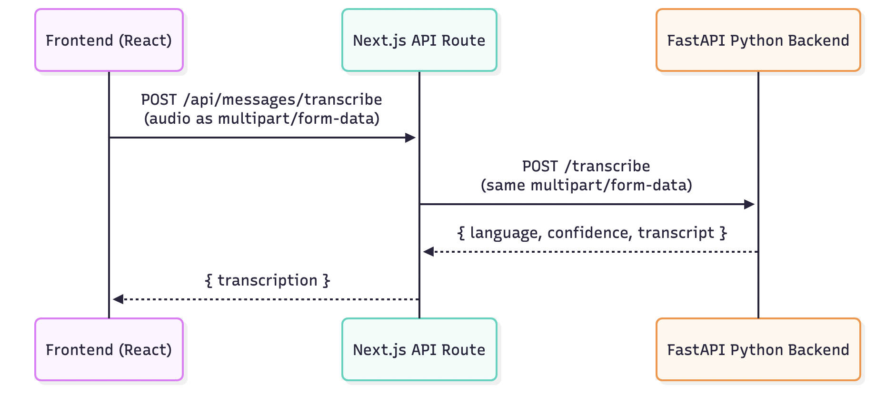
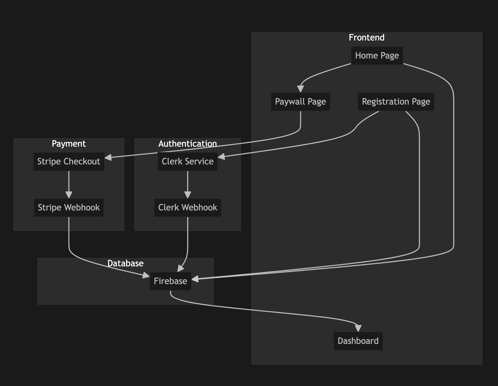
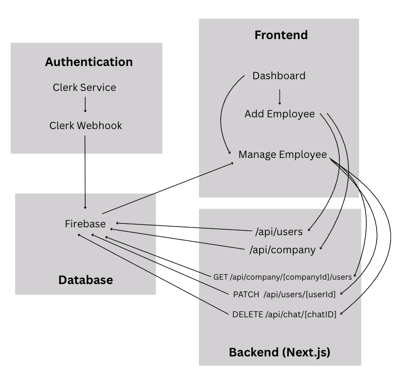
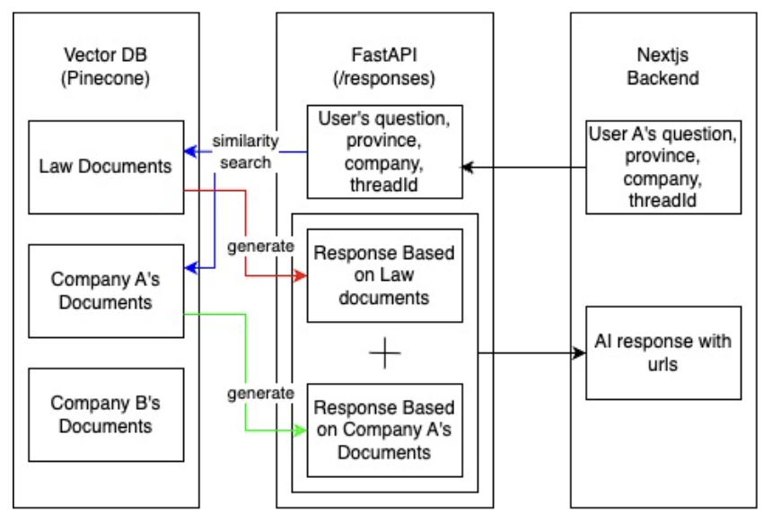
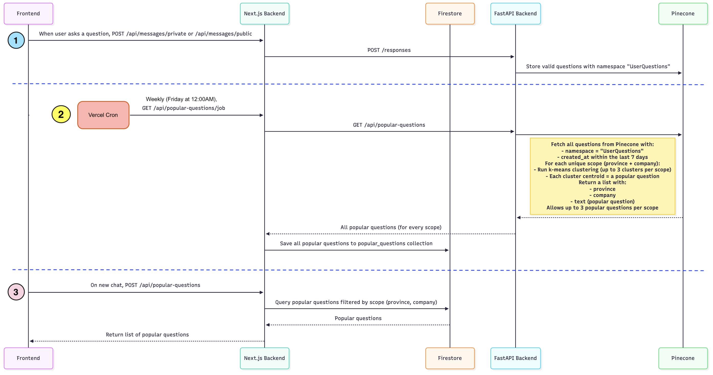

> 🧭 For non-technical overview and usage instructions, see the main [README.md](./README.md).

# Employee Handbook App (Developer Guide)

## Overview

A web-based AI chatbot platform built to help Canadian workers understand employment rights and company policies. Employers can manage teams, upload documents, and view analytics. Chatbot uses Retrieval-Augmented Generation via LangChain and Pinecone.

## Tech Stack

### Frontend

- **Framework:** Next.js
- **UI Libraries:** React, shadcn/ui
- **Styling:** Tailwind CSS
- **Icons:** Lucide Icons

### Backend & AI

- **Languages:** TypeScript (main app), Python (AI module)
- **NLP Tools:** LangChain, LLM APIs
- **API Routing:** Vercel API Routes

### Storage & Infrastructure

- **Database:** Firebase
- **Vector DB:** Pinecone
- **Authentication:** Clerk
- **Hosting:** Vercel, Railway
- **Monitoring:** Sentry
- **Analytics:** Google Analytics
- **Payment Gateway:** Stripe

## Tech Architecture



## Setup, Deployment & Maintenance Guide

This project consists of two parts:

- **Next.js App** — handles most endpoints and the user interface
- **AI Service** — powers the AI chatbot and AI features through a separate Python backend

## Local Setup

### 1. Next.js App

To start the frontend:

```bash
cd employee-handbook-app
npm install
npm run dev
```

- Runs at `http://localhost:3000`
- Ensure `.env` exists in `employee-handbook-app/` with required variables (see **Environment Variables** below)

---

### 2. AI Service (FastAPI)

To start the AI backend:

```bash
cd AIService
pip install -r requirements.txt
uvicorn main:app --reload
```

- Runs at `http://localhost:8000`
- Ensure `.env` exists in `AIService/` with the following:

```env
# Gemini
GOOGLE_API_KEY=<your_google_api_key>

# Pinecone
PINECONE_API_KEY=<your_pinecone_api_key>
PINECONE_INDEX_NAME=<your_pinecone_index_name>
```

For instructions on creating these environment variables, see [Environment_Keys_AI.md](./Environment_Keys_AI.md)

---

### 3. Load Documents into Pinecone (Optional; required if no documents are currently loaded into Pinecone)

Only run this if you've updated `providedDoc.json`, as it can take a while:

```bash
cd AIService
python scrapeAllProvinces.py   # Scrapes and pickles data
python setupProvinces.py       # Uploads data to Pinecone
```

---

## Deployment Instructions

### Frontend (Vercel)

1. Go to [https://vercel.com/signup](https://vercel.com/signup) and sign up (or log in).
2. Authorize Vercel to access your GitHub account.
3. Go to [https://vercel.com/new](https://vercel.com/new) and import your repo.
4. Under Root Directory, choose employee-handbook-app/
5. Leave framework detection as Next.js (Vercel will auto-detect)
6. In the Vercel dashboard, add required environment variables (see **Environment Variables** below)
7. Click deploy.

---

### Backend (Railway)

1. Go to [https://railway.app](https://railway.app) and sign up (or log in).
2. Authorize Railway to access your GitHub account.
3. Click "New Project" -> Deploy from GitHub repo.
4. When asked for Root Directory, select AIService/
5. Set deployment environment to Python (FastAPI)
6. Add the following environment variables in **Project Settings → Variables**:

```env
GOOGLE_API_KEY=<your_google_api_key>
PINECONE_API_KEY=<your_pinecone_api_key>
PINECONE_INDEX_NAME=<your_pinecone_index_name>
NEXT_PUBLIC_SENTRY_DSN=<your_sentry_dsn>
FIRESTORE_API_KEY=<your_firestore_api_key>
FIRESTORE_APP_ID=<your_firestore_app_id>
FIRESTORE_AUTH_DOMAIN=<your_firestore_auth_domain>
FIRESTORE_MEASUREMENT_ID=<your_firestore_measurement_id>
FIRESTORE_MESSAGING_SENDER_ID=<your_firestore_messaging_sender_id>
FIRESTORE_PROJECT_ID=<your_firestore_project_id>
FIRESTORE_STORAGE_BUCKET=<your_firestore_storage_bucket>
```

7. After deploying, Railway will give you a public URL — copy it and use it as the value for the Vercel project's environment variable: `AI_SERVICE_URL`.

**Requirements:**

- Node.js and npm
- Python 3.x and pip

**Environment variables:**

Create a `.env` file and put the following keys:

```
# AI + Hosting
AI_SERVICE_URL=<your_AI_service_public_url>
NEXT_PUBLIC_BASE_URL=<your_base_url> # e.g., http://localhost:3000 (local) or your Vercel URL when deployed

# Sentry
NEXT_PUBLIC_SENTRY_DSN=<your_sentry_dsn>

# Firestore (Public)
NEXT_PUBLIC_FIRESTORE_API_KEY=<your_firestore_api_key>
NEXT_PUBLIC_FIRESTORE_AUTH_DOMAIN=<your_firestore_auth_domain>
NEXT_PUBLIC_FIRESTORE_PROJECT_ID=<your_firestore_project_id>
NEXT_PUBLIC_FIRESTORE_STORAGE_BUCKET=<your_firestore_storage_bucket>
NEXT_PUBLIC_FIRESTORE_MESSAGING_SENDER_ID=<your_firestore_messaging_sender_id>
NEXT_PUBLIC_FIRESTORE_APP_ID=<your_firestore_app_id>
NEXT_PUBLIC_FIRESTORE_MEASUREMENT_ID=<your_firestore_measurement_id>

# Firestore (Server/Admin)
FIRESTORE_API_KEY=<your_firestore_api_key>
FIRESTORE_AUTH_DOMAIN=<your_firestore_auth_domain>
FIRESTORE_PROJECT_ID=<your_firestore_project_id>
FIRESTORE_STORAGE_BUCKET=<your_firestore_storage_bucket>
FIRESTORE_MESSAGING_SENDER_ID=<your_firestore_messaging_sender_id>
FIRESTORE_APP_ID=<your_firestore_app_id>
FIRESTORE_MEASUREMENT_ID=<your_firestore_measurement_id>

# Firebase Admin SDK
FIREBASE_TYPE=service_account
FIREBASE_PROJECT_ID=<your_firebase_project_id>
FIREBASE_PRIVATE_KEY_ID=<your_firebase_private_key_id>
FIREBASE_PRIVATE_KEY=<your_firebase_private_key>
FIREBASE_CLIENT_EMAIL=<your_firebase_client_email>
FIREBASE_CLIENT_ID=<your_firebase_client_id>
FIREBASE_AUTH_URI=<your_firebase_auth_uri>
FIREBASE_TOKEN_URI=<your_firebase_token_uri>
FIREBASE_AUTH_PROVIDER_CERT_URL=<your_firebase_auth_provider_cert_url>
FIREBASE_CLIENT_CERT_URL=<your_firebase_client_cert_url>
FIREBASE_UNIVERSE_DOMAIN=<your_firebase_universe_domain>

# Gemini
GOOGLE_API_KEY=<your_google_api_key>

# Pinecone
PINECONE_API_KEY=<your_pinecone_api_key>
PINECONE_INDEX_NAME=<your_pinecone_index_name>

# Clerk Authentication
NEXT_PUBLIC_CLERK_PUBLISHABLE_KEY=<your_clerk_publishable_key>
CLERK_SECRET_KEY=<your_clerk_secret_key>
CLERK_WEBHOOK_SECRET=<your_clerk_webhook_secret>
CLERK_MODE=<your_clerk_mode> # e.g., development or production

# AWS (used for audio transcription)
AWS_ACCESS_KEY_ID=<your_aws_access_key_id>
AWS_SECRET_ACCESS_KEY=<your_aws_secret_access_key>
AWS_REGION=us-east-2

# Stripe
STRIPE_SECRET_KEY=<your_stripe_secret_key>
NEXT_PUBLIC_STRIPE_PUBLISHABLE_KEY=<your_stripe_publishable_key>
STRIPE_WEBHOOK_SECRET=<your_stripe_webhook_secret>

# EmailJS
EMAILJS_PUBLIC_KEY=<your_emailjs_public_key>
EMAILJS_PRIVATE_KEY=<your_emailjs_private_key>
EMAILJS_SERVICE_ID=<your_emailjs_service_id>
EMAILJS_TEMPLATE_ID=<your_emailjs_template_id>


```

## Re-deployment Instructions

### Re-deploying Frontend (Vercel)

1. Push changes to GitHub: `git push origin main`
2. Vercel will auto-deploy.
3. For Manual redeploy:
   - Go to Vercel Project Deployment
   - Click Redeploy on the latest commit

### Re-deploying Backend (Railway)

1. Push backend changes to GitHub: `git push origin main`
2. Railway will auto-deploy.
3. For Manual redeploy:
   - Go to your project in Railway Dashboard
   - Click the Deploy button

## Plan Upgrade Instructions

### Upgrading to Pro -- Vercel

Since the Hobby (free) tier on Vercel doesn’t allow commercial use, the deployed site has a risk of being taken down from the Stripe integration once payments start being accepted.

1. Go to your project → Settings → Billing
2. Click Upgrade to Pro
3. Confirm payment method
4. Redeploy after upgrading

- More Details: [https://vercel.com/docs/plans/pro](https://vercel.com/docs/plans/pro)

### Upgrading to Pro -- Railway

Our backend is currently using ~900MB of RAM, which exceeds the memory limitation on the Free/Hobby plan.

1. Go to Railway Billing Settings
2. Add or update your payment method
3. Select the Pro Plan from available options
4. Go to your project → Settings → Deployments → Resources
5. Increase Memory Allocation for your backend service to 2 GB
6. Save settings — the upgrade applies instantly

- More details: [https://railway.com/pricing](https://railway.com/pricing)

## Documentation

For API documentation related to the AI service, refer to [`AIService/routes.md`](AIService/routes.md).
For API documentation related to the Next.js app, refer to [`employee-handbook-app/src/app/api/routes.md`](employee-handbook-app/src/app/api/routes.md).

## Deployment Notes for Forked Repository

This project is deployed through a **forked version of the original team repository**:

- Git-based auto-deployment is enabled in Vercel — pushing to the `main` branch of the fork automatically triggers a new deployment.
- However, the fork **does not sync automatically** with the original repo. If updates are made to the original team repository, you’ll need to **manually pull them into the fork** to keep the deployed site up to date.

Be sure to periodically sync the fork if you’re maintaining the production deployment.

## Core Features

- AI Chatbot that answers employee questions
- Public access to general employment laws
- Private, secure login for company-specific policy access
- Document linking and source transparency
- Document uploads, and access to org-specific financial info and analytics
- Accessible on web, mobile, and tablet devices

## AI Feature: Chat Title Generation

### Overview of the Improvement

We added a new AI-powered feature that automatically generates short, descriptive titles for each new chat based on the user’s first message. Previously, chat logs were named generically (e.g., "Chat - 07/10/2025"), making it hard for users to find specific past conversations. With this improvement, titles are generated automatically, improving navigation and usability.

### How to Test the AI Feature

1. Log in to the app and create a new chat.
2. Enter your first message (e.g., “What are the rules for overtime in Ontario?”).
3. The app will send this message to the AI service.
4. Within a few seconds, the chat title in the sidebar will update from a generic name to a meaningful one.
5. A "Generating..." message is briefly displayed while the title is being processed.

> If the AI fails to generate a title (e.g., due to a vague or empty message), the fallback title will be "New Chat".

### Dependencies

This feature builds on existing components already listed in the Tech Stack:

- **LangChain + LLM API (e.g., Gemini or GPT)** – Used to generate chat titles from the first message.
- **FastAPI** – Hosts the AI service and exposes the `/generate-title` endpoint.
- **Firebase** – Used to persist the generated title in the chat document.
- **Next.js (Frontend)** – Sends the user message to the backend and updates the UI with the new title.

### Performance Results

- **Title Accuracy:** Works well for clear questions  
  The AI generates helpful titles when the first message is clear (e.g., “how long a break can be?” → “Break Length Query”). For vague inputs like “Hi”, it still returns a title (e.g., “Simple Hello”), but it's less useful. The feature is reliable and always returns something.

## AI Feature: Voice-to-Text Input

### Overview of the Improvement

This feature introduces a voice-to-text input option for the chatbot, allowing users to speak their questions instead of typing. It enhances accessibility, especially for users with visual impairments or limited mobility, and offers a faster, more natural way to interact with the app. The feature leverages AI-powered speech recognition to transcribe spoken language into text.

### How to Test the AI Feature

1. Go to the deployed application at the [link](https://github.com/csc301-2025-y/project-16-rivvi?tab=readme-ov-file#link-of-the-app) above or run it locally using the [setup instructions](https://github.com/csc301-2025-y/project-16-rivvi?tab=readme-ov-file#setup-for-developers) above.
2. Once you've provided your location, click the mic icon to the left of the input bar to begin recording.
3. Speak your question.
4. Click the mic icon again to stop recording.
5. Wait for your transcription to appear in the input box.
6. You may edit your question, or repeat steps 2–5 to add more text. Once you are satisfied with the text in the box, submit your question by pressing Enter or clicking the search icon to the right of the input bar.

### Dependencies

This feature builds on existing components, as well as incorporates the faster-whisper library, an open-source implementation of OpenAI's Whisper model.

- **faster-whisper** – Used to transcribe audio recordings with the small Whisper model.
- **FastAPI** – Hosts the AI service and exposes the `/transcribe` endpoint.
- **Next.js (Frontend & Backend)** – Frontend sends the audio clip to the backend, which then sends it to the AI service endpoint for transcription.

### Technical Architecture


The implementation flow starts with the user pressing the microphone button on the frontend. This starts the recording using the “react-use-audio-recorder” React library. Then, when the user presses the button again, it stops recording and sends the audio blob in a FormData type to our Next.js API route. This then sends a request to our FastAPI Python backend with the form data audio which uses faster-whisper to transcribe the audio to text. We chose Whisper’s small model because it was a good balance of speed (quick to download) and accurate transcription. Once transcribed, it sends three pieces of data back to Next.js: language, confidence and transcript.

1. Language is the language of the transcription.
2. Confidence is how confident, as a percentage, the Whisper model is with the transcription.
3. Transcript is the actual transcription of the audio. The transcript is sent back to the frontend (as transcription) which is then shown to the user in the textfield.

### Performance Results

- **Transcription Accuracy** - The small faster-whisper model achieves high accuracy on clear, conversational speech with good handling of various accents.
- **Response Time** - Transcription typically completes within 5 seconds for short audio clips (under 30 seconds).
- **Resource Usage** - Running the small faster-whisper model uses minimal system resources, allowing for efficient backend performance.

## AI Feature: Dynamic Graph Explanations for Accessibility

### Overview of the Improvment

We've enhanced web accessibility for visually impaired users by adding AI-generated natural language summaries and bullet-point captions to graphs on the analytics page. As a result, users can understand the information in the graphs without needing to see them.

### How to Test the AI Feature

After the app is started, go to analytics page: http://localhost:3000/analytics

There are two ways to check whether this AI feature is working:

1. Activate the screen reader (on Mac, it's Command + F5. To learn more, check [VoiceOver guide](https://support.apple.com/en-ca/guide/voiceover/vo4be8816d70/10/mac/15.0).) Use Control + Option + Left/Right Arrow keys to navigate to the graph section. After it reads out the title, press Control + Option + Right Arrow again to hear the AI summary. If it says “No AI summary available,” it means the request-per-minute limit has been reached. Wait a minute, then refresh the page.

2. A more straightforward way is to look at the Insights section under the graphs. If the AI fails to generate summaries, you will see “No AI summary available” in that section. Wait a minute, then refresh the page. If everything is working correctly, a few bullet points should appear to represent the insights.

### Dependencies

- **Google Gemini API (JavaScript version)** – Used to generate AI summaries and bullet points.
- **Firebase** – Retrieves information from the database to construct the graph; this data is also included in the prompt sent to the API.
- **Next.js API endpoints** – Exposes the following routes:
  - `/api/ai-summary/bullet-points`
  - `/api/ai-summary/employee-distribution`
  - `/api/ai-summary/employee-registration`
  - `/api/ai-summary/questions-asked`
- **Next.js frontend** – Updates the UI based on the API response.

### Performance Results

Overall, the AI did a good job identifying important trends from the graph and generating the AI summary based on them. The explanation is concise without missing any key information. The bullet points also summarize the explanation very clearly.

## Authentication System


The authentication system implements a user management flow using Clerk as the primary authentication service. The process begins with users accessing the frontend where they encounter registration and login pages. Upon successful authentication through Clerk Service, the system integrates with multiple external services to provide a complete user experience.

The authentication flow includes:

1. **User Registration/Login**: Users interact with the frontend registration and paywall pages
2. **Clerk Service**: Handles user authentication and session management
3. **Webhook Integration**: Clerk webhooks notify our system of user events (registration, updates, etc.)
4. **Payment Processing**: Stripe integration for subscription management through Stripe Checkout and webhooks
5. **Database Management**: Firebase stores user profiles, company data, and session information
6. **Dashboard Access**: Authenticated users are directed to their respective dashboards based on their roles and subscription status

The system ensures secure user onboarding while maintaining scalability through webhook-based event handling and robust payment integration.

## Add / Manage Employees


After signing up, employers can add, manage, or delete employees in their organization. Authentication and access control are managed through Clerk, which assigns roles to both employers and employees. Employee and company data, including profiles, associations, counts, and permissions, is stored in Firebase Firestore.

There are three main parts to the add/manage employees flow:

1. **Authentication and Role Management:** Users authenticate via Clerk, which assigns roles and triggers a webhook to sync user data with Firebase for authorization and company association.
2. **Adding New Employees (Invitation Flow):** Employers submit a form with an employee’s details, triggering an invitation email; upon signup via Clerk, the employee is linked to the employer’s company in Firebase.
3. **Managing & Deleting Employees:** Employers view, update, or delete employees through dashboard actions that call Next.js API routes for CRUD operations on Firebase records scoped by company ID.

## Chatbot

### Overview

Our chatbot uses Retrieval-Augmented Generation (RAG) powered by LangChain to provide accurate and context-aware responses.

### Technical Architecture



### How It Works

1. **Similarity Search**: When a user asks a question, the chatbot searches for documents similar to the query within a vector database.

2. **Document Retrieval**: It pulls relevant documents that best match the user’s question.

3. **Response Generation**: Using the retrieved documents as context, the chatbot generates a response.

The documents retrieved are scoped according to the user’s role, ensuring users only access relevant information.

## Popular Questions

### Overview

When a user is on a new chat, they can see three suggested questions. These suggested questions are popular questions (if they exist) within the user's scope (province for public users; province and company for private users).

### Technical Architecture



There are three main parts to the popular questions implementation:

1. **Storing questions in Pinecone**

When a user asks a question, the frontend calls a Next.js API route (`POST /api/messages/private` or `POST /api/messages/public`), which sends the question to the FastAPI backend `POST /responses`. If the question triggers a document retrieval, it is stored in Pinecone with namespace `UserQuestions`.

2. **Weekly job to find popular questions**

A scheduled job is triggered on Friday at 12:00AM from Vercel Cron using the `GET /api/popular-questions/job` route, which calls FastAPI's `GET /api/popular-questions`. FastAPI fetches all questions from the last 7 days in Pinecone, groups similar ones using k-means clustering for each unique province and company combination, and treats each cluster centroid as a popular question. These popular questions are then saved to Firestore in the `popular_questions` collection. Each document is stored with `createdAt` and `expiresAt` fields. The expiry date is set to 7 days + 1 hour (buffer) ahead of the creation time.

_Recommendation_: enable Firestore TTL on `expiresAt` to auto-delete stale documents.

3. **Retrieving and displaying suggestions**

When a user opens a new chat, the frontend calls Next.js route `POST /api/popular-questions` with the user's province and company, which fetches the relevant popular questions from Firestore. Three questions are displayed to the user. When there are less than three popular questions, the remaining questions shown are hardcoded questions.

## Testing & Edge Case Handling

This project includes a mix of automated test scripts and manual validation.

### Automated Tests

This project uses both **Jest** (for JavaScript/TypeScript) and **Pytest** (for Python) to ensure backend and frontend stability.

#### JavaScript Tests (Jest)

These files follow the format: `**/test/**/*.test.ts`, `**/test/**/*.test.tsx`.

#### Python Tests (Pytest)

Python tests are located in the `AIService/tests` directory.

> GitHub Actions runs both Jest and Pytest on each pull request to `develop` or `main`.  
> This ensures all tests pass before merging.

### Manual Feature Testing

In addition to code-based checks, the following features were manually tested across different user types:

- Role-based login and dashboard redirects
- Stripe subscription & paywall behavior
- AI chatbot responses and fallback states
- Chat title generation via AI
- Audio transcription and accuracy
- Dashboard functionality:
  - Uploading and managing documents
  - Viewing finances
  - Accessing analytics
  - Adding and managing employees
- Response format handling:
  - Verified correct display of chatbot responses in both card and list formats based on content type

## Support

If you have questions or need help, feel free to [open an issue](https://github.com/csc301-2025-y/project-16-rivvi/issues) on the GitHub repository.
