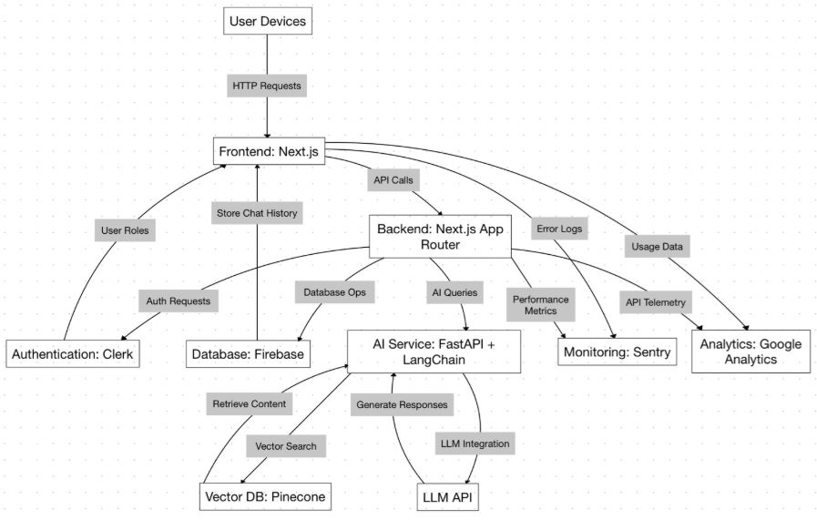
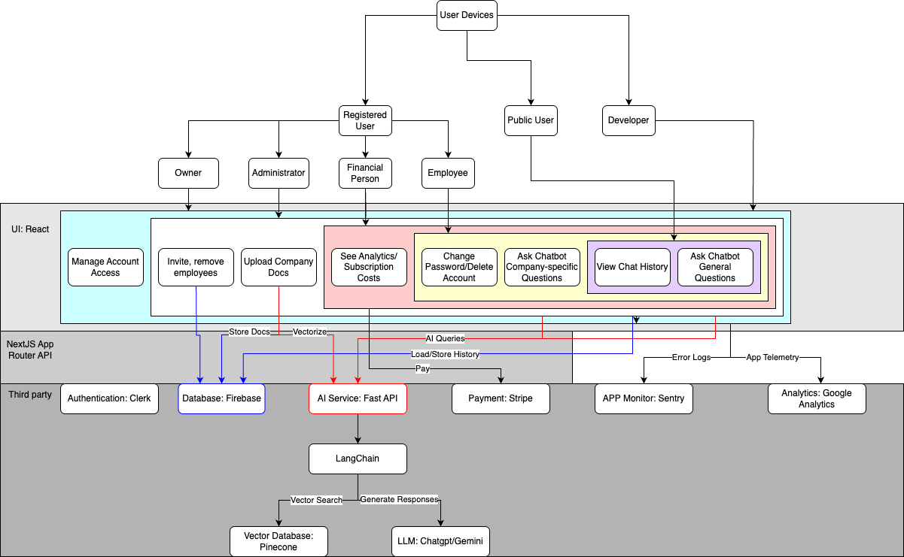
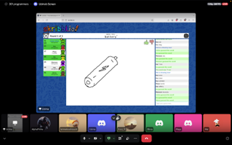

# Employee Handbook App

> _Note:_ This document will evolve throughout your project. You commit regularly to this file while working on the project (especially edits/additions/deletions to the _Highlights_ section).
> **This document will serve as a master plan between your team, your partner and your TA.**

## Product Details

#### Q1: What is the product?
We will be building a chatbot-based Employee Handbook App called *Gail* which allows users/employees to ask questions about workplace guidelines and receive clear answers. This is to make it easier for employees and non-employees to find answers to any workplace-related question that they may have. It should be emphasized that this should not be used as a place to get legal advice regarding workplace policies. It is more of an information booth.

##### About
Our partner, Arshad Merali, is from a fintech company called Rivvi. It is a Toronto-based company founded in 2020. Their goal is to provide tools to improve individuals' financial health.

##### What they want
Our partner wants a webapp that will work on phones, tablets, and computers. The website will have two sections:
1. The first section will be for public users. They will have access to general public information and can get an understanding of their worker rights.
2. The second section will be for private users. These are users given access to their company’s own guidelines and policies. They will be able to ask questions privately and not have to worry about being judged.

The chatbot will provide links as it gives answers so that it can be verified where the information is coming from. It will also have a login page which differentiates between the public and private users. Private users can log in to see company rules and policies, ask questions to the chatbot, and get clear answers with links to where the answers came from.

#### Q2: Who are your target users?

The Employee Handbook App is built for two main user groups:

1. **Public Users**  
   These are general employees across Canada who want to understand their legal work rights. They don’t have access to internal company documents but can use the app to ask questions like “Am I entitled to paid breaks?” and get clear, chatbot-generated answers with links to legal sources.

2. **Private Users**  
   These are employees with access to their specific company’s internal policies. They log in securely to view company policies and use the chatbot to ask questions like “How do I request vacation?” and get accurate, policy-linked responses.

#### Q3: Why would your users choose your product? What are they using today to solve their problem/need?

Whether someone is searching for workplace-related laws or private company policies, efficiently finding this information can be a daunting task. A Google search often leads to inconsistent results consisting of hard-to-interpret legal jargon and most companies use hard-to-navigate platforms like SharePoint to share documents. Our product directly solves this issue by providing a simple interface for users to ask questions and get instant answers. This can be especially beneficial for people who are afraid to ask questions due to nervousness or fear of sounding unknowledgeable, including new hires.

There are many benefits to our chatbot-based web app:

- Instant, judgment-free access to reliable information  
  Users can privately ask sensitive or “simple” questions without fear of judgment. This encourages engagement, while increasing access to crucial knowledge.

- Time-saving and ease-of-use  
  Digging through HR manuals or waiting for HR replies is too time-consuming. The chatbot allows users to get fast answers with links to relevant public laws or internal documents for verification.

- Better accuracy and discoverability  
  Answers are backed by specific PDFs and links from public policy resources or company-uploaded documents.

- Customized information for various users  
  Public users access Canadian and provincial workplace rights, while private employees can log in to query company-specific policies. Company representatives can upload company documents and manage employees. Hence, the experience is highly relevant to each user group.

Robofy’s HR Policy Chatbot is a similar AI assistant that helps employees access internal company policies and workplace guidelines. However, Robofy is designed for internal use. Our product expands on this by also considering users searching for information about public labor laws.

Glean AI offers enterprise-wide search across platforms like Slack, Jira, GitHub, etc. It’s a complex tool designed for broad internal knowledge management. In contrast, our product is a standalone solution focused on delivering workplace policy information. It’s especially suited to small businesses without large IT teams.

Our product delivers value by empowering employees (B2C) and helping companies improve internal communication and policy accessibility (B2B).

Furthermore, our partner, Rivvi, supports transparency and empowerment. Our product aligns with these values by enhancing access to essential workplace knowledge that directly affects employee morale and confidence.

#### Q4: What are the user stories that make up the Minumum Viable Product (MVP)?

- At least 5 user stories concerning the main features of the application - note that this can broken down further
- You must follow proper user story format (as taught in lecture) `As a <user of the app>, I want to <do something in the app> in order to <accomplish some goal>`
- User stories must contain acceptance criteria. Examples of user stories with different formats can be found here: https://www.justinmind.com/blog/user-story-examples/. **It is important that you provide a link to an artifact containing your user stories**.
- If you have a partner, these must be reviewed and accepted by them. You need to include the evidence of partner approval (e.g., screenshot from email) or at least communication to the partner (e.g., email you sent)

User Story #1: As a user of this application, I want to learn about the general laws in the workforce in order to better understand the current policies of jobs.  
Acceptance Criteria: An unauthenticated user should be able to access the AI chatbot, send simple queries, and receive appropriate, up-to-date answers.

User Story #2: As an employee using this application, I want to find the specific documents and sources that state my work-related entitlements in order to have reassurance and prevent embarrassment by my seemingly low-level or redundant questions.  
Acceptance Criteria: After registering, an employee should be able to access relevant information from the AI chatbot specific to their company’s policies in a quick and intuitive way.

User Story #3: As the head of a company (employer) using this application, I want to have an isolated space for my employees to better understand the company's policies in order to affirm that we have the same understanding of workplace relations.  
Acceptance Criteria: A company head should be able to register their company with the application and upload general company policies for their employees.

User Story #4: As an employer or an employee, I want to have reassurance that the information that I’m getting is accurate and up to date.  
Acceptance Criteria: The AI chatbot will provide links at the end of each message it sends which will contain the information text from which it generated the response from.

User Story #5: As a newly registered employee using this application, I want to join my company’s space so that I can view and interact with the specific policies uploaded by my employer.  
Acceptance Criteria: After registration, an employee should be able to search for or enter a unique company code to join their employer’s company space. Once joined, the employee should be able to view uploaded policies and use the chatbot to ask questions based on company-specific documents.

User Story #6: As a registered user using this application, I want to view my personal history of questions and chatbot answers so that I can easily revisit previous information without having to ask the same question again.  
Acceptance Criteria: After logging in, a registered user should be able to open a “My History” page that shows only their own past questions with the corresponding chatbot responses and source links, accessible to only that user.

User Story #7: As the financer of a company using this application, I want to be able to access the usage analytics and subscription costs so I can budget for the platform and track ROI.  
Acceptance Criteria: Upon logging in, a company financer should view relevant details on their dashboard in the form of a chart.

User Story #8: As a regional administrator using this application, I want to be able to upload workplace documents specific to my area so employees have access to relevant regional company policies.  
Acceptance Criteria: Upon logging in, a regional administrator should be able to upload relevant documents in the same way the company head can, but which will only be accessible by the respective regional employees.

User Story #9: As a registered user using this application, I want to be able to change my password so I can ensure the security of my account.  
Acceptance Criteria: Upon logging in, a user should have an option to change their password through their profile/settings.

User Story #10: As a registered user using this application, I want to be able to delete my account so it is no longer under the company’s registered users.  
Acceptance Criteria: Users should be able to terminate their account in an intuitive way through their profile/settings if they ever choose to.

#### Q5: Have you decided on how you will build it? Share what you know now or tell us the options you are considering.

> Short (1-2 min' read max)

- What is the technology stack? Specify languages, frameworks, libraries, PaaS products or tools to be used or being considered.
- **Framework**

  - Next.js
  - LangChain

- **Frontend**

  - Core UI Library: React
  - Component Library: shadcn/ui (React components)
  - Styling: Tailwind CSS
  - Icons: Lucide Icons (React components)

- **Backend**

  - Next.js App Router
  - FastAPI (for AI)
  - LLM API

- **Database**

  - Firebase
  - Pinecone (Vector Database)

- **Programming Language**

  - TypeScript (Main App)
  - Python (AI)

- **Hosting & CI/CD**

  - Hosting: Vercel
  - CI/CD: GitHub Actions

- **Authentication**

  - Clerk

- **Payment Gateway**

  - Stripe

- **Application Monitoring**

  - Sentry

- **Analytics**

  - Google Analytics

- How will you deploy the application?

The application will be deployed on Vercel.

- Describe the architecture - what are the high level components or patterns you will use? Diagrams are useful here.

This application has a series of high-level components including the Frontend, Backend, AI Service, Authentication, Vector Database, and Monitoring & Analytics. It uses RAG (Retrieval-Augmented Generation) in order to combine any document retrievals with LLMs to ensure accurate, cited responses. Additionally, microservices, JWT-based authentication, and CI/CD also make up aspects of this application. In the diagram below, arrows demonstrate primary data flows.

The following diagram illustrates the target users of our app, the core features it offers, and the external services it integrates with.

- Will you be using third party applications or APIs? If so, what are they?

Yes. We will use third-party applications including Clerk (auth), Stripe (payments), Firebase (database), Pinecone (vector DB), Sentry (monitoring), and Google Analytics (analytics). For AI features, we may integrate LangChain and LLM APIs.

---

## Intellectual Property Confidentiality Agreement

> Note this section is **not marked** but must be completed briefly if you have a partner. If you have any questions, please ask on Piazza.
>
> **By default, you own any work that you do as part of your coursework.** However, some partners may want you to keep the project confidential after the course is complete. As part of your first deliverable, you should discuss and agree upon an option with your partner. Examples include:

1. You can share the software and the code freely with anyone with or without a license, regardless of domain, for any use.
2. You can upload the code to GitHub or other similar publicly available domains.
3. You will only share the code under an open-source license with the partner but agree to not distribute it in any way to any other entity or individual.
4. You will share the code under an open-source license and distribute it as you wish but only the partner can access the system deployed during the course.
5. You will only reference the work you did in your resume, interviews, etc. You agree to not share the code or software in any capacity with anyone unless your partner has agreed to it.

**Your partner cannot ask you to sign any legal agreements or documents pertaining to non-disclosure, confidentiality, IP ownership, etc.**

Briefly describe which option you have agreed to.

We have agreed on Option 5: We will only reference the work we did in our resumes and interviews. We agree not to share the code or software in any capacity with anyone unless our partner has explicitly agreed to it.

## Teamwork Details

#### Q6: Have you met with your team?

##### Team-Building Activity

Yes, we met online via Discord for a team-building social activity. We spent about 1 hour and 40 minutes playing a few fun online games together, including **Codenames**, **Skribbl**, and **Gartic Phone**. All team members attended, and we had a great time bonding and getting to know each other better in a relaxed setting.

##### Fun Facts from Our Team:

- We briefly debated whether frogs are edible while playing Codenames.
- Mamoon and Uzima like _Avatar: The Last Airbender_.
- Maya is in Greece.
- As a group, we’ve identified that arrows are very important in drawings while playing Skribbl.

#### Q7: What are the roles & responsibilities on the team?

## Role Descriptions

| **Role**            | **Description**                                                                                                                                                                                                                                                |
| ------------------- | -------------------------------------------------------------------------------------------------------------------------------------------------------------------------------------------------------------------------------------------------------------- |
| Backend Developer   | Implements server-side logic, APIs, authentication, and ensures data flow to frontend.                                                                                                                                                                         |
| Frontend Developer  | Builds responsive UI components and is mainly responsible for the user interface.                                                                                                                                                                              |
| UI/UX Designer      | Designs wireframes, user flows, and high-fidelity Figma prototype; collaborates with developers to ensure designs are implemented accurately; ensures interface is user-friendly, accessible, and meets both business requirements and user needs.             |
| AI Engineer         | Builds RAG pipelines to process questions and generate responses; integrates LLM APIs; develops REST APIs for AI-related features; ingests policies into a vector database; optimizes the system for accuracy; performs web scraping if PDFs are not provided. |
| DevOps Engineer     | Deploys the entire project on Vercel; sets up the CI/CD pipeline; manages credentials.                                                                                                                                                                         |
| Product Manager     | Communicates with partner to schedule meetings, deliver updates and ask questions; ensures project stays within scope and aligns with partner vision; coordinates team workflow and task assignments.                                                          |
| Development Manager | Ensures technical execution is flawless, handles code quality and architecture, makes sure team is meeting deadlines and helps solve technical issues as they arise                                                                                            |
|                     |
| Scrum Master        |                                                                                                                                                                                                                                                                |

## CSC301_Programmers Roles

| **Name** | **Roles**                                           | **Experience**                                                                                                                                                                                                                                                                                                                                                            |
| -------- | --------------------------------------------------- | ------------------------------------------------------------------------------------------------------------------------------------------------------------------------------------------------------------------------------------------------------------------------------------------------------------------------------------------------------------------------- |
| Maya     | Backend Developer, Development Manager              |                                                                                                                                                                                                                                                                                                                                                                           |
| Olivia   | UI/UX Designer, Product Manager, Frontend Developer | I have experience with Figma and front-end development through personal projects, professional experience, and academic work, including CSC309. I’ve also had startup experience, where I worked closely with businesses and partners to align product goals and guide development.                                                                                       |
| Mamoon   | Backend Developer, Frontend Developer               |                                                                                                                                                                                                                                                                                                                                                                           |
| Isabella | AI Engineer, DevOps Engineer                        | In my CSC309 project, I tested and deployed everything manually, so this time I’m interested in exploring CI/CD to streamline the development workflow. Additionally, I want to gain experience working with large language models (LLMs), as my previous AI experience has been in other domains.                                                                        |
|          |
| Maleeha  | Backend developer, Frontend developer, UI/UX        | I have experience with full stack development from courses like CSC309, and although I do feel slightly more comfortable working with the backend, I want to gain more confidence when it comes to the frontend. Additionally, I’m also quite interested in user interface and user-centered design from my time in CSC318 and hope to put my knowledge to good use here. |
| Hussain  | Backend Developer, Frontend Developer               | I have experience building full-stack applications, including designing responsive user interfaces and developing RESTful APIs with secure authentication flows. I've also maintained large-scale projects with high user engagements and retention.                                                                                                                      |
| Uzima    | AI Engineer, Scrum Master                           |                                                                                                                                                                                                                                                                                                                                                                           |

#### Q8: How will you work as a team?

##### Internal Team Meetings

Our team will meet twice a week (online via Discord) on a regular schedule to ensure consistent progress and communication:

- **Tuesdays: 7 PM - 8 PM**
- **Sundays: 12 PM - 1 PM**

These meetings will serve several purposes:

- Share individual progress and blockers
- Collaboratively plan next steps and upcoming tasks
- Prepare and refine questions for our TA and/or partner
- Conduct informal code reviews and demos of current features
- Troubleshoot problems together and align on implementation details

We will also hold ad hoc coding sessions and reviews as needed, especially around deadlines.

##### Partner Meetings

Partner meetings involve aligning on the product vision by asking questions to ensure clarity, while also sharing progress.

We have had two meetings with our partner:

- **Partner Meeting 1**: Friday, May 23, 2025, 10 AM – 11 AM (Zoom)  
  Covered introductions, project scope, expectations, and key features.
- **Partner Meeting 2**: Monday, May 26, 2025, 10 AM - 11 AM (Zoom)  
  Asked follow-up questions, gathered feedback on Figma design.

All partner meeting minutes have been added to the repo under the `deliverables/minutes` folder.

We plan to establish a weekly partner meeting schedule. For now, Mondays at 10 AM - 11 AM seems suitable for everyone.

#### Q9: How will you organize your team?

List/describe the artifacts you will produce to organize your team. (We strongly recommend that you use standard collaboration tools like Linear.app, Jira, Slack, Discord, GitHub.)

- Artifacts can be To-Do lists, Task boards, schedule(s), meeting minutes, etc.
- We want to understand:
  - How do you keep track of what needs to get done? (You must grant your TA and partner access to systems you use to manage work)
  - **How do you prioritize tasks?**
  - How do tasks get assigned to team members?
  - How do you determine the status of work from inception to completion?

We'll use Slack or Discord to stay in touch as a team and have quick conversations when we need to collaborate. For keeping track of our development work, we'll create GitHub issues whenever we need to add new features, fix bugs, or make improvements. This approach will help us stay organized, solve problems quickly, and support each other along the way.

We might also use a project management tool like Jira to organize and prioritize our tasks and user stories. If that doesn't work for us, we can use shared documents to keep track of our work and monitor our progress.RetryClaude can make mistakes. Please double-check responses.

We’ll keep track of what needs to get done by maintaining a shared backlog of user stories and tasks, organized either in Jira or the shared document. Tasks will be prioritized based on importance to the MVP and upcoming deliverables, with input from the team during our weekly meetings. We'll label tasks by priority and complexity to help with planning. Tasks will be assigned based on each member’s strengths, role, and interest, but there’s also flexibility to pair up or switch if someone wants to try something new. To track the status of work, each task will move through stages like “To Do,” “In Progress,” “Code Review,” and “Done,” allowing the whole team to see what’s being worked on and what’s complete.

#### Q10: What are the rules regarding how your team works?

## Communication

### Frequency and Channels:

- The team meets twice a week:  
  Tuesdays: 7–8pm  
  Sundays: 11am–1pm

- Meetings are held online.
- During weeks with upcoming assignments or deliverables, we may schedule additional meetings as needed.
- We will use **Discord** for real-time team communication and discussions between meetings.
- For task tracking and collaboration, we use **GitHub Issues** and **structured Google Docs** for task management.

### For partner project communication, we will:

- Assign one or more team members (likely the Product Manager, Olivia, and Scrum Master, Uzima) to serve as the main points of contact.
- Ask questions, give updates, and share meeting notes proactively.
- Hold at least 2 meetings with the partner before D1 is due (held on **Friday 10–11 am** and **Monday 10–11 am**), and then continue regular syncs as needed.

---

## Collaboration & Accountability

### Attendance and Action Items:

- Team members are expected to attend all scheduled meetings unless they have a valid conflict communicated in advance.
- All meetings will have minutes documented.
- During each meeting, we will review action items, track task progress, and flag blockers.

### Task Tracking and Status:

- We will use **GitHub Issues** to track feature development, bugs, improvements, and questions.
- Tasks will be prioritized based on **MVP goals** and **urgency**.
- The **Development Managers (Maya and Mal)** and the **Scrum Master (Uzima)** will help ensure task assignments are clear and progress is monitored.

### Assignment of Work:

Tasks are assigned based on each member’s role, strengths, and current load, with flexibility for learning and collaboration.  
For instance, AI-related tasks will primarily go to **Isa and Uzima** (AI Engineers), while back-end tasks will be picked up by **Mal, Maya, Mamoon, Uzima, and Hussain**.

### If a Team Member is Unresponsive or Not Contributing:

- First, we will reach out directly via Discord to check in and understand the issue.
- If unresponsiveness continues, the Scrum Master and Development Managers will intervene and potentially redistribute the workload.
- If the issue persists and affects deliverables, we will inform the course staff (TA/Instructor).

## Organisation Details

#### Q11. How does your team fit within the overall team organisation of the partner?

Our team is taking on a product development role within Rivvi's broader organizational structure. Rivvi’s core team is focused on building and maintaining the company’s core modules, such as payroll, time tracking, and scheduling. For example, the CTO manages the core product, while two developers are presently working on the payroll engine. Since our team is building the Employee Handbook App from the ground up as an independent, stand-alone module, a product development role is the most appropriate fit for our team.

Furthermore, we are contributing to product expansion and helping Rivvi explore new service verticals. Our goal is to deliver an effective solution that can be used by multiple companies and user groups while supporting both public and private access.

#### Q12. How does your project fit within the overall product from the partner?

Our project is the first working prototype (MVP) of an AI-powered chatbot platform that helps both public and private users access employment rights and company policies through a conversational interface. We are responsible for building the core features: a chatbot for legal and company-specific questions, public vs authenticated employee access, secure login and registration, an employer dashboard to upload policies, and linked sources in chatbot responses.

This chatbot is designed as a separate offering from Rivvi’s core product, meaning customers of this new tool do not necessarily need to be existing Rivvi customers. This new module is intended to integrate well with Rivvi’s ecosystem, despite being able to function independently.

Below is our mockup of the interface for the MVP.

Our team is responsible for the full development, both frontend and backend. Success for the partner means delivering a fully functional MVP that includes all core features necessary for real-world use. The MVP should be stable, usable across devices and ready for testing by real users. 

## Potential Risks

#### Q13. What are some potential risks to your project?

1. AI Hallucinations: One significant risk is the potential for the AI chatbot to generate inaccurate or fabricated information (hallucinations), which could mislead users or cause implementation challenges
2. Feature Ambiguity: There may be differing interpretations of key features, leading to confusion around the scope, functionality or intentions behind design. This could result in mismatched expectations between team members and the partner.
3. Imbalance prioritization of tasks or features: There’s a risk of over-focusing on certain features at the expense of others, which might lead to an uneven user experience or meeting deadlines for deliveries.
4. Lack of Employer Engagement: The success and accuracy of the private user chatbot depends on employers actively uploading and maintaining their company policies, so if they do not participate fully, employees won’t benefit from tailored responses
5. Imbalanced workload between frontend and backend teams: There’s a possibility that the workload between front and back end may become uneven since the technical scope is still evolving and it is unclear how much effort and time each side requires, which may lead to delays or coordination issues.

#### Q14. What are some potential mitigation strategies for the risks you identified?

## Risks and Mitigation Strategies

### Risk: AI Chatbot Hallucinations

**Mitigation Strategies:**

- Limit chatbot responses to only pull from trusted legal/policy sources.
- Provide clear citations and links with every answer so users can verify the information.
- Implement a feedback feature allowing users to flag incorrect or unclear responses.
- Include a disclaimer stating that the chatbot is not offering legal advice.

---

### Risk: Different Interpretations of Feature Definitions or Expectations

**Mitigation Strategies:**

- Improve clarity by writing detailed user stories and acceptance criteria.
- Use visual mockups or flow diagrams to illustrate features before implementation.
- Review requirements regularly in meetings and during check-ins with our project partner.

---

### Risk: Imbalanced Prioritization of Tasks or Features

**Mitigation Strategies:**

- Align all prioritization decisions with the MVP goals and the four priorities outlined in the project brief.
- Revisit and adjust task priorities during weekly meetings as needed.
- Ensure that the Scrum Master and Development Managers maintain balanced workload distribution and track progress.

---

### Risk: Lack of Employer Engagement

**Mitigation Strategies:**

- Design an onboarding flow that guides employers through uploading policies step-by-step.
- Include reminder prompts and tooltips in the employer dashboard to encourage policy updates.
- Build a feedback mechanism: if no company data exists, the chatbot gracefully defaults to general public law responses.

---

### Risk: Imbalanced Workload Between Frontend and Backend Teams

**Mitigation Strategies:**

- Continuously review and refine the technical task breakdown as requirements evolve.
- Track how much work each task will take using GitHub Issues and adjust who works on what based on that.
- Encourage collaboration between frontend and backend developers.
