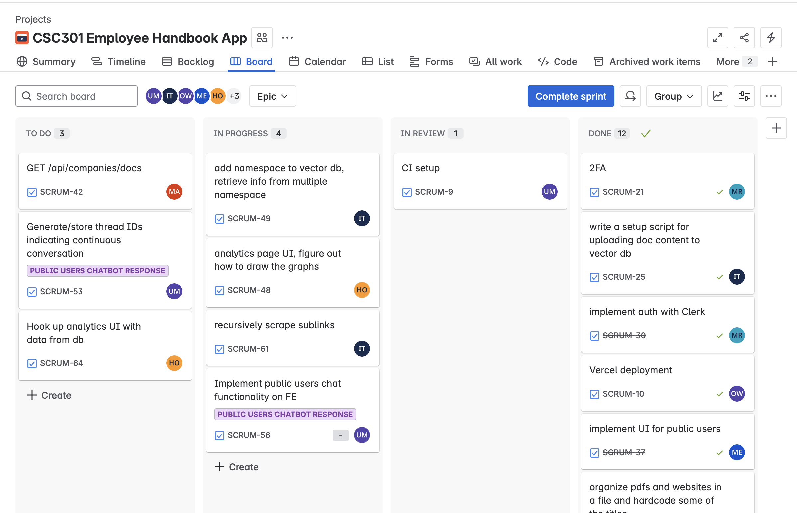
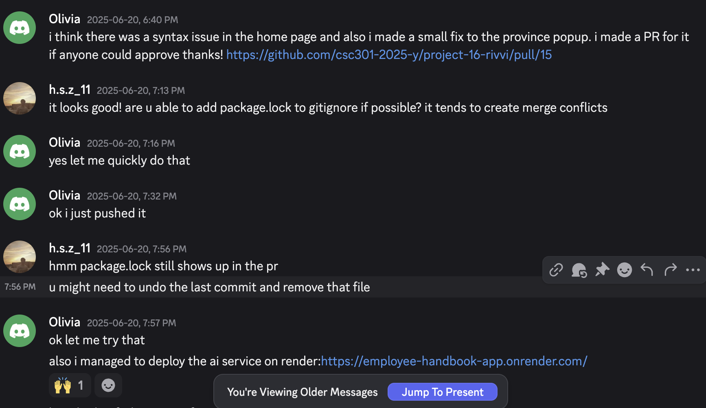
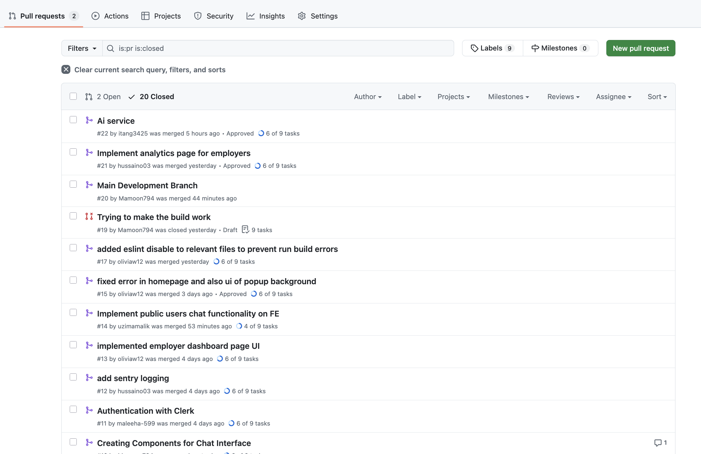

# Team 16 - CSC301_programmers

## Iteration 2 - Review & Retrospect

 * When: Sunday, June 22nd at 12:00 PM.
 * Where: Online (via Discord)

## Process - Reflection

#### Q1. What worked well

##### 1. Organized Workflow with Jira and Scrum Deadlines

We used Jira to track all development tasks, organized into weekly Scrum sprints. Each task was logged as a ticket with clearly defined priorities and assigned ownership.

Before adopting Jira, it was difficult to track responsibilities across such a large project. We occasionally duplicated work or tasks were distributed unevenly, which led to wasted time. Implementing the Jira board solved this by giving us a centralized, transparent workflow. It significantly boosted productivity, reduced overlap, and helped us maintain a steady and measurable development pace.

##### 2. Quick Communication via Discord

In addition to our scheduled team meetings, we used our Discord group chat for fast, asynchronous coordination within the team.

This effective communication channel allowed us to quickly resolve blockers, discuss design decisions, and share updates without relying on additional meetings. This lightweight approach kept our workflow agile and helped us maintain momentum throughout the project.

##### 3. Use of Pull Requests and Branching Strategy

We followed a Git flow where each feature or fix was developed in a separate branch, then reviewed via pull requests. We used a pull request template and required reviews before merging.

This encouraged collaborative review, reduced bugs, and avoided merge conflicts.

##### 4. Early Alignment on MVP Scope

We agreed early on what our MVP included: chatbot Q\&A, login system, source-linked responses, and public/private user modes. This helped prevent feature creep and made workload planning easier.

It gave everyone a shared understanding of priorities and ensured the team worked toward the same goals.

#### Q2. What did not work well

List **process-related** (i.e. team organization and how you work) decisions and actions that did not work well.

 * 2 - 4 important decisions, processes, actions, or anything else that did not work well for you, ordered from most to least important.
 * Give a supporting argument about what makes you think that way.
 * Feel free to refer/link to process artifact(s).

1. Figma Screens Were Not Fully Finalized Before Development
- Some of the Figma designs were still being discussed or revised while we began development. As a result, certain UI decisions such as layout fixes, or page flows had to be changed mid-build based on usability concerns or new partner feedback. This made implementation less efficient, as components had to be refactored or restructured after initial work was already done.

2. Lack of initial consistent code reviews early on
- In the earlier stages, we did not have a fully consistent code review process. This led to some inconsistencies in the styling, and component reuse across different parts of the frontend code. As the codebase grew, this required additional refactoring to align components and code styles and standards. Earlier enforcement of code review guidelines could have reduced these small inconsistencies.

3. Insufficient early communication regarding team roles
- During the initial development stages, it wasn't clear about the role assignments, and which team member was going to work on which aspect of the app, such as backend or frontend. This sometimes led to misunderstandings about feature priorities, implementation details, and deadlines. As a result, certain features were either delayed or had a lot of code conflicts due to misinterpreted requirements. More structured and regular cross-functional meetings could have helped resolve these issues early on.

#### Q3(a). Planned changes

##### 1. `develop` Branch
To improve coordination during deployment, we are adopting a new branching strategy that introduces a shared `develop` branch. We occasionally encountered build errors only after merging directly into `main`, which made integration more difficult when multiple features were involved.

Going forward, all feature branches will be merged into the `develop` branch first for pre-merge testing. Once verified, changes will be merged into `main`. This approach will help us catch build issues, integration conflicts, and deployment problems earlier, before they impact production.

##### 2. Slack Channel with Partner
We recently created a shared Slack channel with our partner and plan to begin using it actively moving forward. Up until now, most communication has happened via email and weekly Zoom calls, which sometimes caused delays in receiving feedback or clarifying minor questions.

Slack will provide a more immediate and informal communication channel, allowing us to quickly resolve small issues, ask clarifying questions, and stay more aligned without needing to schedule additional meetings.

#### Q3(b). Integration & Next steps

We prioritized core features and split them into frontend and backend tasks. To work in parallel, we selected independent tasks and assigned them based on interest and skill set during weekly team meetings. Each feature was developed in its own branch, and when branches diverged, we regularly rebased or merged main into feature branches to minimize conflicts and resolve issues early through communication.

## Product - Review

#### Q4. How was your product demo?
##### How we prepared
We focused on finalizing and deploying the web app on Vercel and the AI service on Render. Our top priority was ensuring that core components such as sign-up, login, the AI service API (which accesses the third-party LLM), and the chat interface were functional, styled, and accessible. We verified that users could navigate the app and interact with key elements, even if some underlying logic was still being developed.

##### What we managed to demo
- Sign-up and login flow
- Access control (private users vs public users)
- AI chat HTTP requests
- Preliminary chat interface for private users

##### Partner feedback
Arshad (our partner) appreciated the clear direction and UI. He also gave suggestions for making the user flow more simple and intuitive, as we had various screens. 

##### What we learned
Early feedback on real UI helps us make efficient changes and prioritize refinements.
